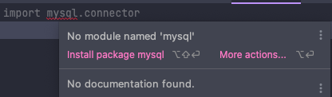
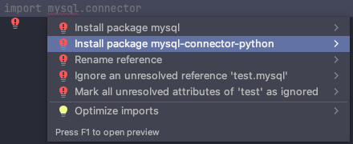

# CFG_project
CFG project - Group 4 - Movies For You

Saamiya - To view the app, here is a simple tutorial on how to run a python file in the command prompt on Windows:

https://www.wikihow.com/Use-Windows-Command-Prompt-to-Run-a-Python-File

and here for MAC users:

https://pythonbasics.org/execute-python-scripts/

Packages you will need to run the MoviesForYou.pu

Front-end
- Flask 
- Flask-WTF

API
- requests

Database
- mysql-connector-python

#### Instructions for installing mysql-connector-python with pycharm
First go into database.db_connection.py and hover over mysql

Then click more actions

Finally select the second option down which says "Install package mysql-connector-python"

in database.db_config input your password and make sure user is correct

open DB_movie_recommendations.sql in MySQLWorkbench and run it
